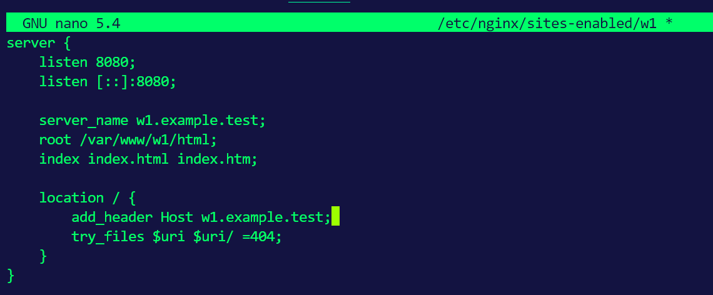
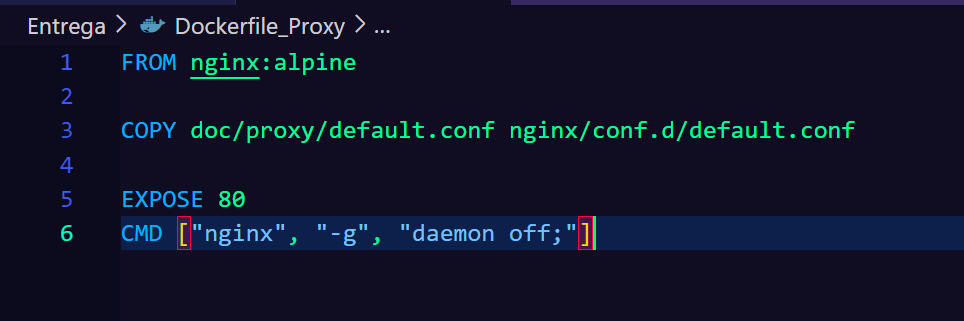
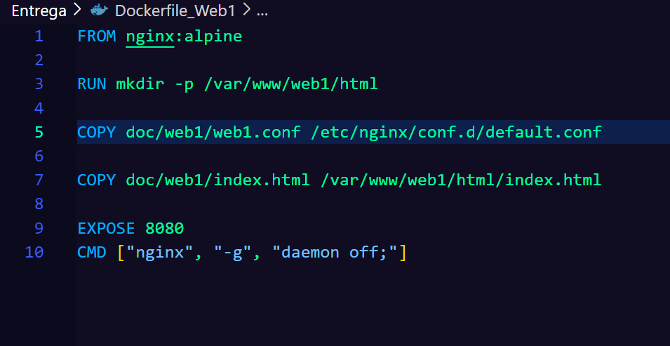
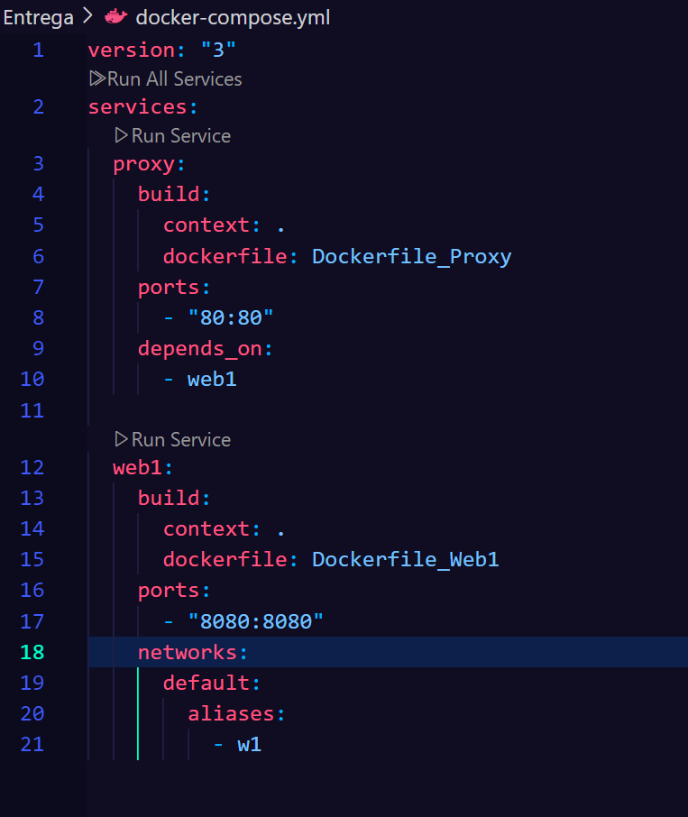
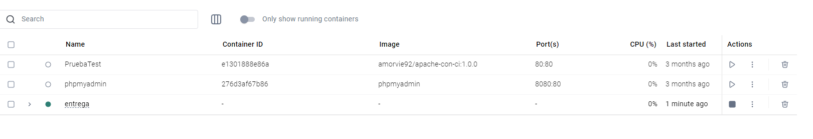
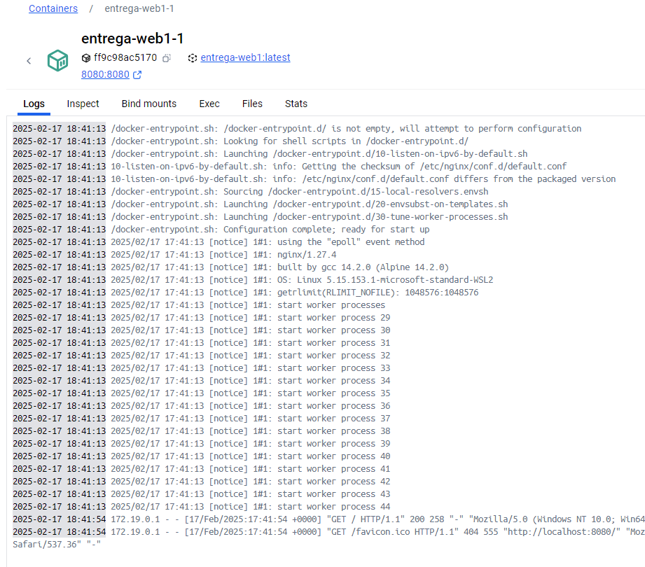
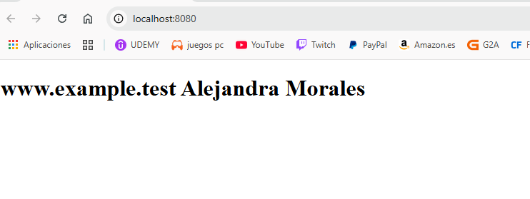

# Proxy Inverso

## Vagrantfile

```bash 

Vagrant.configure("2") do |config|
  config.vm.box = "debian/bullseye64"
  config.vm.provider "virtualbox" do |vb|
    vb.memory = "256"
  end # virtualbox

  # Provisión común
  config.vm.provision "shell", inline: <<-SHELL
    apt-get update && apt-get install -y nginx
  SHELL

  # Proxy
  config.vm.define "proxy" do |p|
    p.vm.hostname = "www.example.test"
    p.vm.network "public_network"
    p.vm.network "private_network", ip: "192.168.57.10"
  end # proxy

  # Web
  config.vm.define "web" do |w|
    w.vm.hostname = "w1.example.test"
    w.vm.network "private_network", ip: "192.168.57.11"
  end # web
end

```


Creamos el directorio y de damos permisos:


Añadimos el contenido al fichero:


Creamos el enlace simbolico:

```bash 

sudo ln -s /etc/nginx/sites-available/w1 /etc/nginx/sites-enabled/

```
Añadimos el contenido a index.html:


Instalamos curl y lo probamos:


##  Configuración del proxy

Consulatamos la ip:


Una vez creado el backup del archivo default, se suprime el original y se sustituye por el siguiente:


Comprobamos errores y reiniciamos el servidor:

```bash 
sudo nginx -t
sudo systemctl restart nginx
```

Editamos el host:


Editamos el sites-enabled:


Editmos el hsot del anfitrion (el pc con el que vamos a navegar a la web):


Visitamos http://www.example.test/:


Para ver el trafico usamos el siguiente comando:

```bash 

vagrant ssh -c "sudo tail /var/log/nginx/access.log" web
vagrant ssh -c "sudo tail /var/log/nginx/access.log" proxy

```


##  Añadir cabeceras al proxy inverso

Entramos en vagrant ssh proxy, y en sites-enabled/default añadimos:

```bash 
add_header X-frien proxy_example;
```
 

##  Añadir cabeceras al servidor web

 Entramos en vagrant ssh web, y en sites-enabled/w1 añadimos:

```bash 
add_header Host w1.example.test;
```



#  2 Despliegue con Docker

1. Configuracion de un contenedor para proxy basado en Nginzx que redirige las peticiones hacia el servidor web, llamado Dockerfile_Proxy

 

2. Configuracion de un contenedor para Wev1 basado en Nginx para servir el contenido HTML que hay en Dockerfile_Web1

 

3.  Define ambos contenedores como servicios y asigna alias de red, permitiendo que el proxy pueda acceder al contenedor web1 mediante el nombre "w1".

 

Para hacer el despliegue, basta con ejecutar en la carpeta raiz del proyecto el siguiente comando, el cual ejecutara el archivo docker-compose.yml:

```bash 

docker-compose up --build

```

En la app Docker aparecera nuestro contenedor entrega:







